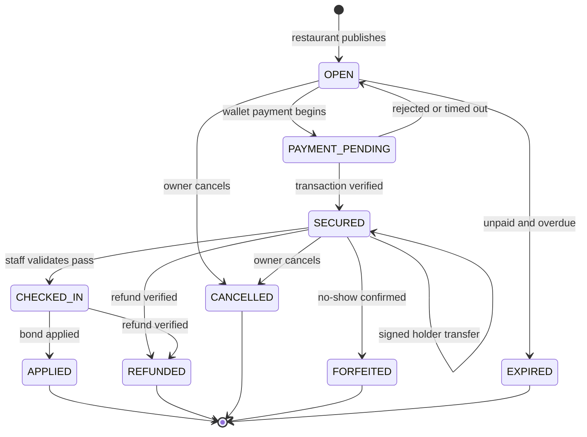

# Pactum


> Protect the table without trapping the guest.

[Live app](https://pactum-delta.vercel.app/) · [API health](https://pactum-api.samuelsuccess234.workers.dev/api/v1/health) · [Feasibility evidence](docs/FEASIBILITY.md) · [Verification record](docs/VERIFICATION.md)

## The problem

> “We’re turning away walk-ins for these tables and then they just sit empty all night.”

That is how one restaurant owner described large-party no-shows in a [restaurant-owners discussion](https://www.reddit.com/r/restaurantowners/comments/1rmguwk/how_do_you_handle_noshows_for_reservations/). The responses reveal the usual trade-off: card holds and deposits reduce no-shows, but restaurants worry about booking friction, processor fees, policy disputes, and extra administration.

Guests face the other half of the problem. When plans change, the person who paid may not be the person who attends. In one [fine-dining discussion](https://www.reddit.com/r/finedining/comments/1shjfk4/awkward_reservation_deposit_situation/), a guest was told to settle a transferred dinner privately because the restaurant could not redirect the original deposit. Industry reporting confirms why restaurants still need protection: more than 90 of the UK’s top 100 restaurants surveyed by *The Observer* charged for no-shows or late cancellations, citing food preparation, scheduled staff, and lost earnings ([The Guardian](https://www.theguardian.com/food/2023/jul/02/its-dead-money-almost-all-top-british-restaurants-now-charge-for-no-shows)).

The problem is not simply “take a deposit.” Restaurants need a credible commitment. Guests need proof, clear terms, and a graceful way to hand the reservation to someone else.

## The solution

Pactum is a transferable reservation bond built as a Nimiq Pay Mini App.

A restaurant creates a bond for one reservation. The guest reviews its exact terms and sends NIM directly to the restaurant. Pactum independently verifies the on-chain transaction before issuing a wallet-bound QR pass. If plans change, the current holder signs a transfer to another Nimiq address. The old pass becomes invalid immediately. Approved restaurant staff can then scan the current pass, check the guest in, and apply the bond to the final bill.

Pactum does **not** hold funds, promise automatic refunds, or act as escrow. It adds a verifiable commitment layer beside an existing phone, website, OpenTable, Resy, or Tock booking.

### What each party receives

| Restaurant | Guest |
|---|---|
| Direct NIM payment to its own wallet | Clear amount, policy, deadline, and recipient before payment |
| Independent proof that the bond was paid | A live wallet-bound reservation pass |
| One current holder after every transfer | A signed transfer instead of a phone call or private resale |
| Restaurant-scoped staff permissions | A QR that contains no private reservation data |
| Check-in, apply, refund, cancel, and forfeit actions | Refunds return to the verified original payer |
| Append-only audit timeline | An explicit record of payment and holder status |

## End-to-end product flow

```mermaid
flowchart LR
    A[Restaurant connects wallet] --> B[Creates reservation bond]
    B --> C[Shares public link or QR]
    C --> D[Guest opens link in Nimiq Pay]
    D --> E[Reviews amount and policy]
    E --> F[Approves direct NIM payment]
    F --> G[Backend verifies transaction]
    G -->|Exact match| H[Secured wallet-bound pass]
    G -->|Mismatch or pending| I[Reject or keep confirming]
    H --> J{Plans changed?}
    J -->|Yes| K[Holder signs transfer]
    K --> L[Pass version increments]
    L --> M[Old QR invalid; new holder active]
    J -->|No| N[Current holder presents QR]
    M --> N
    N --> O[Approved staff validates pass]
    O --> P[Check in]
    P --> Q[Apply bond to bill]
```



## Reservation lifecycle



Transfer is an event, not a payment state. It changes `holder_address` and increments `pass_version`; the payer and payment remain unchanged.

## Architecture

```mermaid
flowchart TB
    subgraph NP[Nimiq Pay]
        UI[React Mini App]
        SDK[@nimiq/mini-app-sdk]
        WALLET[User wallet]
        UI --> SDK --> WALLET
    end

    subgraph CF[Cloudflare]
        API[TypeScript Worker API]
        AUTH[Nonce and signature verifier]
        STATE[Bond state machine]
        VERIFY[Payment and refund verifier]
        PASS[Pass and transfer service]
        DB[(D1 database)]
        API --> AUTH
        API --> STATE
        API --> VERIFY
        API --> PASS
        AUTH --> DB
        STATE --> DB
        VERIFY --> DB
        PASS --> DB
    end

    RPC[Nimiq mainnet JSON-RPC]
    UI -->|HTTPS /api/v1| API
    WALLET -->|sign and send NIM| RPC
    VERIFY -->|independent lookup| RPC
```

### Trust boundaries

- Wallet actions happen through the provider injected by Nimiq Pay.
- Pactum never requests, receives, or stores private keys or recovery phrases.
- A client-reported transaction hash cannot secure a bond by itself.
- The Worker verifies network, recipient, sender relationship, exact luna amount, data reference, execution, confirmation, uniqueness, and intent lifetime.
- Staff access is scoped to one restaurant. Refund permission is opt-in.
- QR codes contain short-lived tokens bound to `pass_version`, not raw guest data.
- Every state-changing action is authorized, version-aware, and audited.

## Core journeys

### Restaurant onboarding and bond creation

1. The owner connects the restaurant’s Nimiq wallet.
2. Pactum creates a short-lived nonce and readable registration message.
3. The wallet signs it; the API verifies address ownership.
4. The owner enters the reservation time, party size, NIM amount, deadline, and policy.
5. Pactum publishes immutable payment terms and returns a public link.

### Guest payment

1. The guest opens `/p/:publicId` inside Nimiq Pay.
2. Pactum shows the exact restaurant wallet, amount, reservation, and policy.
3. The API creates a short-lived payment intent.
4. Nimiq Pay presents its native confirmation.
5. The Mini App receives a hash, but does not treat it as proof.
6. The Worker independently retrieves the transaction and secures the bond only after every field matches.

The on-chain reference is `PACTUM:<publicId>:v1`, sent through `sendBasicTransactionWithData`.

### Holder transfer

1. The holder enters the recipient’s Nimiq address.
2. Pactum builds a readable, versioned transfer statement.
3. The holder signs it in Nimiq Pay.
4. The Worker verifies the signature, holder, nonce, expiry, domain, and pass version.
5. The holder changes atomically and `pass_version` increments.
6. Previously issued QR codes fail immediately.

No money moves during a transfer.

### Staff validation and completion

1. The owner approves a staff wallet and chooses whether it may refund.
2. Staff scan the live QR or enter its short code.
3. The API checks token expiry, restaurant access, current holder, and pass version.
4. Staff check the guest in and later apply the bond to the bill.
5. The audit timeline records each transition.

## Technology

| Layer | Technology |
|---|---|
| Mini App | React 19, TypeScript, Vite, React Router |
| Wallet | `@nimiq/mini-app-sdk` |
| Signatures | Nimiq signed messages, `@noble/ed25519` |
| QR | `qrcode.react`, `qr-scanner` |
| API | Cloudflare Workers |
| Database | Cloudflare D1 |
| Verification | Nimiq mainnet JSON-RPC |
| Tests | Vitest and Playwright |
| Hosting | Vercel and Cloudflare |

## Repository map

```text
.
├── src/                       React Mini App and wallet integration
├── worker/
│   ├── src/                   Worker API and transaction verifier
│   ├── migrations/            D1 schema migrations
│   └── seed.sql               Rehearsal-only data
├── tests/e2e/                 Playwright mobile smoke tests
├── docs/                      Architecture, demo, privacy, and evidence
└── .github/workflows/ci.yml   CI, audit, and secret scanning
```

## Local development

### Prerequisites

- Node.js 22 or later
- npm
- Nimiq Pay for real wallet testing
- A Cloudflare account only for deploying your own API and D1 database

### Install and run

```bash
git clone https://github.com/mrfomoweb3/Pactum.git
cd Pactum
npm ci
cp .env.example .env.local
npm run dev
```

The landing page works in a normal browser. Payment and signing require Nimiq Pay; outside it, Pactum remains a read-only preview.

### Environment variables

```dotenv
VITE_API_URL=https://your-worker.example.com/api/v1
VITE_NIMIQ_PAYOUT_ADDRESS=NQ00 ...
```

`VITE_API_URL` selects the verification API. A restaurant profile wallet becomes the payout address for newly created bonds. `VITE_NIMIQ_PAYOUT_ADDRESS` supports the original fixed development fixture.

Never place private keys, recovery words, wallet secrets, or API credentials in a `VITE_` variable. Vite exposes those values to the browser.

## Cloudflare Worker and D1

Authenticate Wrangler, create or select a D1 database, and update the binding in `worker/wrangler.jsonc`.

```bash
npx wrangler whoami
npx wrangler d1 migrations apply pactum-db --local --config worker/wrangler.jsonc
npm run worker:check
```

Apply production migrations and deploy explicitly:

```bash
npx wrangler d1 migrations apply pactum-db --remote --config worker/wrangler.jsonc
npm run worker:deploy
```

Restrict `ALLOWED_ORIGINS` to the deployed frontend. Do not use `*` in production.

### Rehearsal data

```bash
npx wrangler d1 execute pactum-db --local \
  --config worker/wrangler.jsonc \
  --file worker/seed.sql
```

Seeded rows are labeled rehearsal data. They never represent a live payment.

## Quality checks

```bash
npm run lint
npm run typecheck
npm run test
npm run build
npm run worker:check
npm run test:e2e
npm audit --audit-level=high
```

The latest recorded run passed lint, type checking, 9 unit tests, the production build, the Worker dry-run, 2 mobile Playwright tests, and the dependency audit with zero known vulnerabilities. Exact evidence lives in [`docs/VERIFICATION.md`](docs/VERIFICATION.md).

Automated tests do not replace the final manual flow inside Nimiq Pay.

## Production deployment

### Frontend

1. Import the repository into Vercel.
2. Set `VITE_API_URL` to the Worker’s `/api/v1` URL.
3. Build with `npm run build` and publish `dist/`.
4. Preserve the SPA rewrite in `vercel.json`.

### API

1. Apply all remote D1 migrations.
2. Set the production frontend in `ALLOWED_ORIGINS`.
3. Deploy with `npm run worker:deploy`.
4. Confirm `/api/v1/health` returns a current block number.

Current deployment:

- Mini App: https://pactum-delta.vercel.app/
- API: https://pactum-api.samuelsuccess234.workers.dev/api/v1
- Network: Nimiq MainAlbatross, network ID `24`

## Feasibility result

The mandatory payment spike reached **GO**. A real `0.01 NIM` payment was initiated in Nimiq Pay, returned a transaction hash, and was independently verified by the Worker. The verifier handled Nimiq Pay’s internal HTLC sender while still enforcing the selected payer relationship, recipient, amount, network, reference, execution result, and confirmation.

See [`docs/FEASIBILITY.md`](docs/FEASIBILITY.md) for the recorded hash, verification source, retry lesson, and remaining device work.

## Security and privacy

- No custodial wallets or private-key storage
- Random, short-lived, single-use nonces
- Readable, purpose-bound signatures
- Hashed bearer sessions
- Exact server-side transaction verification
- Unique payment and refund hashes
- Restaurant-scoped staff authorization
- Explicit refund permission
- Short-lived, version-bound QR passes
- Bounded bodies and public-endpoint rate limits
- Restricted production CORS
- Dependency and secret scanning in CI
- Minimal public data and documented retention

Read [`docs/PRIVACY.md`](docs/PRIVACY.md) for the complete disclosure.

## Honest limitations

- Pactum is not escrow. Funds go directly to the restaurant.
- Refunds are separate restaurant-authorized transactions to the original payer.
- A transfer changes who may use the reservation; it does not transfer funds.
- Partial refunds, disputes, fiat conversion, POS integration, and automated policy enforcement are outside the MVP.
- The complete transfer, staff, and refund journey still needs one final clean-session rehearsal with distinct controlled wallets.
- Restaurant operators remain responsible for their policies and legal obligations.

## Documentation

- [`docs/ARCHITECTURE.md`](docs/ARCHITECTURE.md) — system boundaries
- [`docs/DEMO.md`](docs/DEMO.md) — two-minute flow and fallback
- [`docs/FEASIBILITY.md`](docs/FEASIBILITY.md) — real NIM evidence
- [`docs/PRIVACY.md`](docs/PRIVACY.md) — collection and retention
- [`docs/SUBMISSION.md`](docs/SUBMISSION.md) — competition copy
- [`docs/VERIFICATION.md`](docs/VERIFICATION.md) — commands actually run

## License

Pactum is released under the [MIT License](LICENSE).
